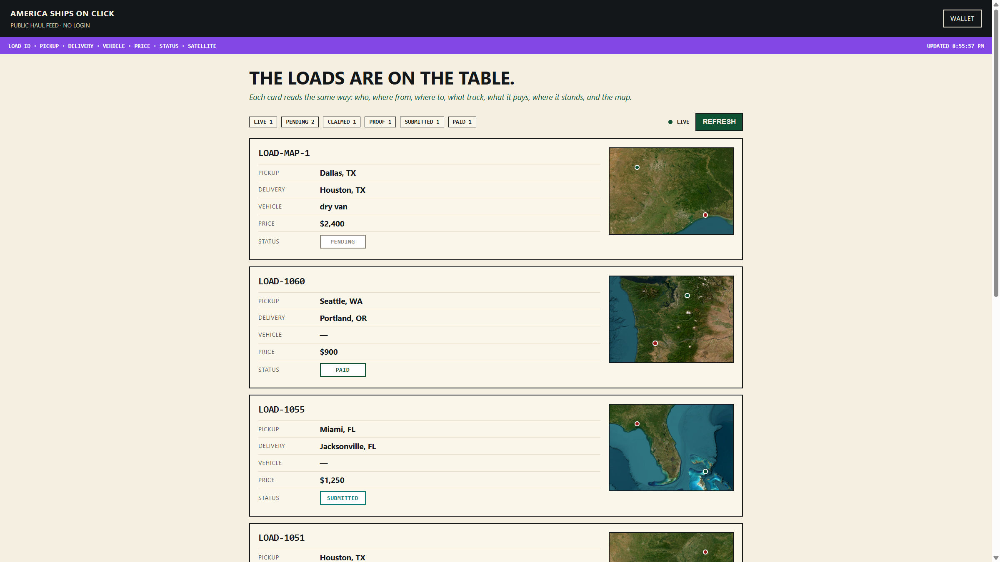
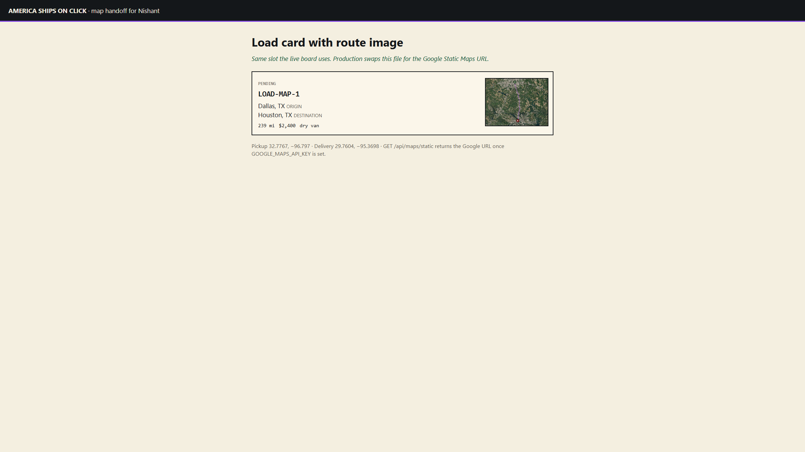
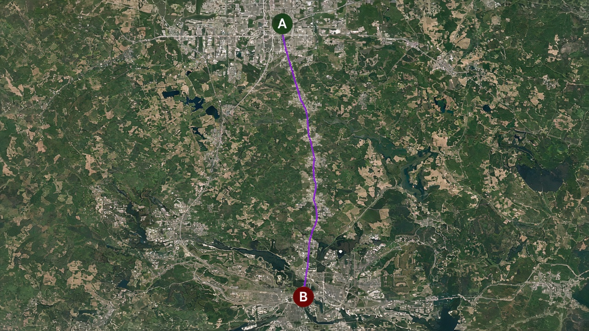

# Static route map — handoff for Nishant

America Ships On Click stores one satellite route image per posted load and shows it on the board next to pickup, drop, vehicle, and pay.

Google Cloud login and billing live on your account, so this machine cannot mint the Maps API key. The wiring is in. Paste `GOOGLE_MAPS_API_KEY` after you enable **Maps Static API** in Google Cloud Console. Until then the board still draws satellite from ArcGIS so shippers are not looking at a blank box.

## What we tested locally (2026-09-10)

- Unit tests: `npx hardhat test test/maps.test.ts` — 3 passing.
- Preview endpoint: `GET http://localhost:3001/api/maps/static?pickupLat=32.7767&pickupLng=-96.797&destLat=29.7604&destLng=-95.3698`
- Posted `LOAD-MAP-1` Dallas → Houston through `POST /api/webhook/ASOC`. Coords saved. `map_url` is `null` until the Google key is set (by design — posting does not wait on Google).
- Board at `http://localhost:3001/feed` shows that load with a satellite thumbnail.

## Endpoints

### 1. Preview the Google URL (no write)

`GET /api/maps/static`

**Query**

| Param | Type | Required | Meaning |
|---|---|---|---|
| `pickupLat` | number | yes | Pickup latitude |
| `pickupLng` | number | yes | Pickup longitude |
| `destLat` | number | yes | Delivery latitude |
| `destLng` | number | yes | Delivery longitude |

**200 — key not set yet (what we got locally)**

```json
{
  "configured": false,
  "url": null,
  "size": "400x220",
  "scale": 2,
  "maptype": "hybrid",
  "pickup": { "lat": 32.7767, "lng": -96.797 },
  "delivery": { "lat": 29.7604, "lng": -95.3698 }
}
```

**200 — after `GOOGLE_MAPS_API_KEY` is set**

Same shape, `configured: true`, and `url` is the Google Static Maps image URL (hybrid satellite, marker A at pickup, marker B at delivery, purple path). One URL per load. The board `` is what actually fetches the PNG from Google.

**400** if any coordinate is missing.

```
GET /api/maps/static
→ { "error": "pickupLat, pickupLng, destLat, destLng required" }
```

### 2. Post a load (this is the production path)

`POST /api/webhook/ASOC`  
Header: `x-webhook-secret: change-me` (local).  
`Content-Type: application/json`

```json
{
  "type": "load.created",
  "loadId": "LOAD-MAP-1",
  "origin": "Dallas, TX",
  "dest": "Houston, TX",
  "pickupLat": 32.7767,
  "pickupLng": -96.797,
  "destLat": 29.7604,
  "destLng": -95.3698,
  "miles": 239,
  "rate": 240000,
  "equipment": "dry van"
}
```

**Returns** `{ ok: true, result: { load, sms } }`. The load row includes `pickup_lat`, `pickup_lng`, `dest_lat`, `dest_lng`, and `map_url`.

With a Google key, `map_url` is stored on that row before the handler returns. Without a key, `map_url` stays `null` and create still succeeds.

### 3. Board read

`GET /api/loads` → `{ source: "postgres", loads: [...] }`  
Each load may include `map_url`. The public board (`/feed`) renders that URL in the thumbnail. If `map_url` is empty, it falls back to ArcGIS World Imagery with pickup/drop pins so the card is never blank.

## Google URL we store

```
https://maps.googleapis.com/maps/api/staticmap
  ?size=400x220
  &scale=2
  &maptype=hybrid
  &markers=color:0x0F5132|label:A|{pickupLat},{pickupLng}
  &markers=color:0x9B1C1C|label:B|{destLat},{destLng}
  &path=color:0x8247E5FF|weight:4|{pickupLat},{pickupLng}|{destLat},{destLng}
  &key=YOUR_KEY
```

Column: `loads.map_url` (text).

## Turn Google on (your Console, two minutes)

1. [Google Cloud Console](https://console.cloud.google.com/google/maps-apis) → enable **Maps Static API**.
2. Credentials → API key. Restrict it to Maps Static API.
3. Billing must be on for Maps Platform (required by Google, not by us).
4. Put the key in `.env` as `GOOGLE_MAPS_API_KEY=` and restart `npm run api`.
5. Post another load. `result.load.map_url` should start with `https://maps.googleapis.com/maps/api/staticmap`.

Do not commit the key.

## Sample on a load

Live local board after posting `LOAD-MAP-1` (Dallas → Houston, dry van, $2,400). Satellite is on the right of the card:



Same thumbnail slot, close-up, with the stored image next to the load fields:



What the Google hybrid tile is meant to look like (pickup A, drop B, route line):



## Files

- `src/maps.ts` — builds the Google URL
- `src/dispatch.ts` — on `load.created`, writes `map_url` if the key exists
- `src/index.ts` — `GET /api/maps/static`
- `public/feed.html` — board thumbnail
- `public/maps-handoff.html` — this same card, standalone
